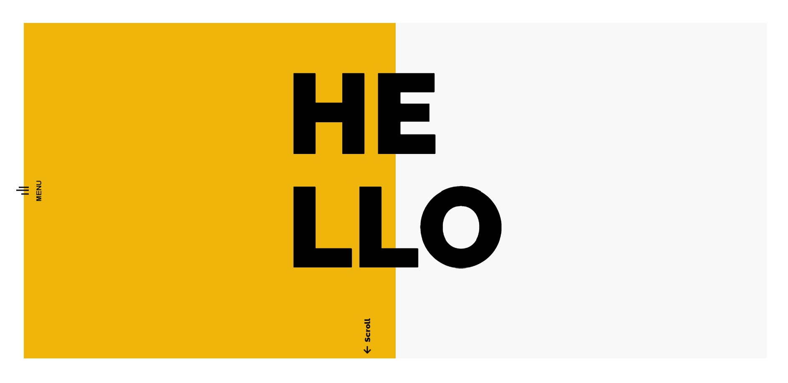

## I wanted a new portfolio

It recently occurred to me that throughout my self-learning journey I've never had a platform to show off my work. I did try (and fail) a while back to create a portfolio website but never finished it. I liked the homepage however I never had the desire to expand upon it, thus leaving the file lying dormant in my projects folder. This time I wanted to create it using new technologies to push myself and make it a learning experience.

<figure>
  
  <em>My old website</em>
</figure>

## What was I looking for?

1. **Performace** - I want something fast, I don't want users to looking at loading spinners.
2. **React Based** - After a creating a few projects I have become comfortable with the technology and love the fast performace.
3. **Easy Updating** - Updates should be swift and easy to deploy 
4. **Animations, animations, animations** - I'm wanting to dive deep into an animations package because animations make websites look cool right?
5. **Search Engine Optimisation** - It's a long term game
6. **Organisation** - Typically with my projects I have no file structure and make it up as I go along.

## So what did I chose?

1. **GatsbyJS** - Utilises the latest web technologies - React.js, Webpack, modern Javascript and more.
2. **GSAP and Scrollmagic** - GreenSock is a JavaScript framework which makes it easy to animate HTML elements. It's very robust and been part of the industry for a long time. Pairing it with scrollmagic allows for timelines to be created allowing for control on when the animations occur.